# Advent of Code

Repo to store my Advent of Code solutions. Some days have been solved with no solutions stored here as they were solved as part of a work event (and I haven't bothered copying them into this repo yet).

<!-- AOC TILES BEGIN -->
<h1 align="center">
  2023 - 50 ⭐ - Python
</h1>
<a href="solutions/2023/python/day-1.py">
  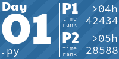
</a>
<a href="None">
  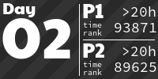
</a>
<a href="None">
  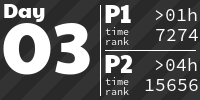
</a>

<a href="None">
  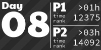
</a>

<a href="None">
  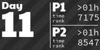
</a>
<a href="None">
  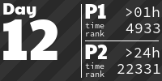
</a>
<a href="None">
  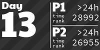
</a>
<a href="None">
  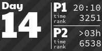
</a>

<a href="None">
  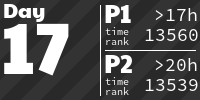
</a>
<a href="None">
  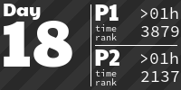
</a>
<a href="None">
  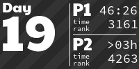
</a>
<a href="None">
  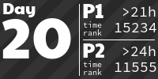
</a>
<a href="None">
  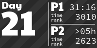
</a>
<a href="solutions/2023/python/day-22.py">
  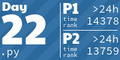
</a>
<a href="solutions/2023/python/day-23.py">
  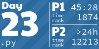
</a>

<a href="solutions/2023/python/day-25.py">
  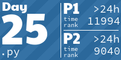
</a>
<h1 align="center">
  2022 - 12 ⭐ - Python
</h1>

<a href="None">
  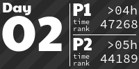
</a>

<a href="solutions/2022/python/day-6.py">
  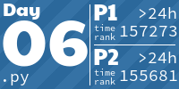
</a>
<!-- AOC TILES END -->